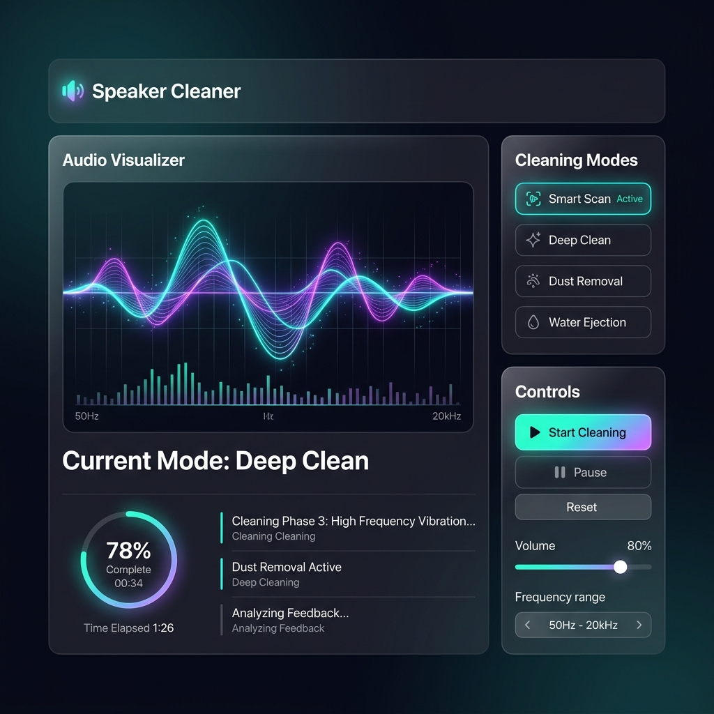

<div align="center">
  

  <a href="#">
    
  </a>
  <br>

  
  
  
</div>

<br>

<div align="center">
  
</div>

<br>

A powerful, zero-dependency, single-file web application designed to safely vibrate dust, lint, water, and dried liquid residue (like shampoo or soda) out of your smartphone's speakers. 

Built purely with HTML, CSS, and vanilla JavaScript using the **Web Audio API**.

---

## ✨ Features

- **Targeted Speaker Cleaning:** Choose between `Earpiece` (high-frequency focus) and `Bottom Speaker` (full-range/bass focus). Frequencies are dynamically bounded to physically match the target speaker's driver size.
- **Hardware Isolation (Stereo Panning):** Leverages `StereoPannerNode` to isolate audio channels. By holding an iPhone in landscape mode, the app forces audio strictly to the left (earpiece) or right (bottom speaker) channel to prevent iOS from blending them.
- **Aggressive Audio Presets:**
  - 💧 **Water Eject**: Rapid low-frequency sine wave pulses to push water out.
  - 🌬️ **Dust & Debris**: Wide mid-range triangle wave sweeps.
  - 🔊 **Deep Clean**: Full-range aggressive square wave sweeps.
  - ⚡ **Shock / Gunk**: Extremely rapid, heavy square pulses for viscous/dried liquids.
  - 🔨 **Jackhammer**: 20Hz pulsing designed for intense physical displacement.
  - 🚨 **Siren Sweep**: Fast resonance sweeps to shatter stubborn crusted debris.

---

## 🛠️ iOS Quirks Bypassed
Apple heavily sandboxes Web Audio on iOS Safari. This app implements massive workarounds to ensure it functions perfectly on iPhones:
1. **Mute Switch Override**: iOS Web Audio normally respects the physical hardware mute switch. This app injects and loops a silent, hidden `<audio>` element (MP3) on first touch to force iOS into the "Playback" audio session, completely bypassing the hardware mute toggle.
2. **Screen-Off Playback**: Utilizes the `Media Session API` in tandem with the looping MP3 to trick the OS into keeping the Web Audio oscillators running even when the phone screen is locked.

---

## 🚀 Usage

Since this is a single file without a build step or framework, deployment is trivial.

### Local Development
1. Clone the repository.
2. Open `index.html` in any modern web browser.

### Vercel Deployment
You can deploy this instantly to Vercel (or Netlify/GitHub Pages):
```bash
npx vercel
```

---

## 💡 Pro-Tips for Stubborn Clogs (e.g., Dried Shampoo)

1. Open the app on your phone.
2. Select **Earpiece** or **Bottom Speaker**.
3. Select the **🔨 Jackhammer** or **⚡ Shock** mode.
4. Turn the app slider volume to 100%, and your phone's physical volume buttons to max.
5. Hold the phone **screen-down** (so gravity helps).
6. **While the app is buzzing**, take a clean, dry toothbrush with soft bristles and gently brush the speaker mesh back and forth. The vibrations shatter the dried residue while the bristles flick it out.

> **⚠️ WARNING:** Never use a needle, pin, or liquid to clean your smartphone speakers. You will easily puncture the waterproof membrane and permanently destroy the speaker driver. 

---

## 📝 License
MIT License. Free to use, modify, and distribute.
